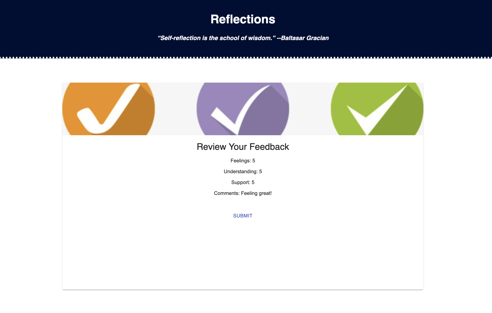
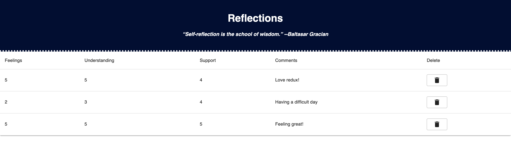

# Redux-Feedback-Loop

## Description

Duration: 10 hours

Created a feedback form for users and admin. Feedback is collected over four views: feelings, understanding, support, and comments. Users can review and edit their feedback as needed. Once they have submitted their feedback, responses are saved to a database and inserted into a table only accessible by admin. Admin can view, track, and delete responses as needed. 

## Screen Shot

### Prerequisites

- [Node.js](https://nodejs.org/en/)
- PostgreSQL
- React-redux
- Material UI & Material UI icons pack

## Installation

1. Create a database named `prime_feedback`,
2. The queries in the `tables.sql` file are set up to create all the necessary tables and populate the needed data to allow the application to run correctly. The project is built on [Postgres](https://www.postgresql.org/download/), so you will need to make sure to have that installed. We recommend using Postico to run those queries as that was used to create the queries, 
3. Open up your editor of choice and run an `npm install`

4. Run `npm run server` in your terminal
5. Run `npm run client` in your terminal
6. The `npm run client` command will open up a new browser tab for you!

## Usage
How does someone use this application? Tell a user story here.

1. Users enter their feedback on four different screens.
2. Review feedback and use the back buttons to edit responses as needed.
3. Submit feedback to send it to the database.
4. Access the admin page by typing localhost3000/#/admin
5. View the admin table to track users' prior responses and delete when done

## Built With

- HTML/CSS
- React
- Redux
- Node
- Postgres
- Material UI
- JavaScript
- Express 
- Axios 

## License

## Acknowledgement
Thanks to [Prime Digital Academy](www.primeacademy.io) who equipped and helped me to make this application a reality.

## Support
If you have suggestions or issues, please email me at [jfredericksen12@gmail.com](www.google.com)
